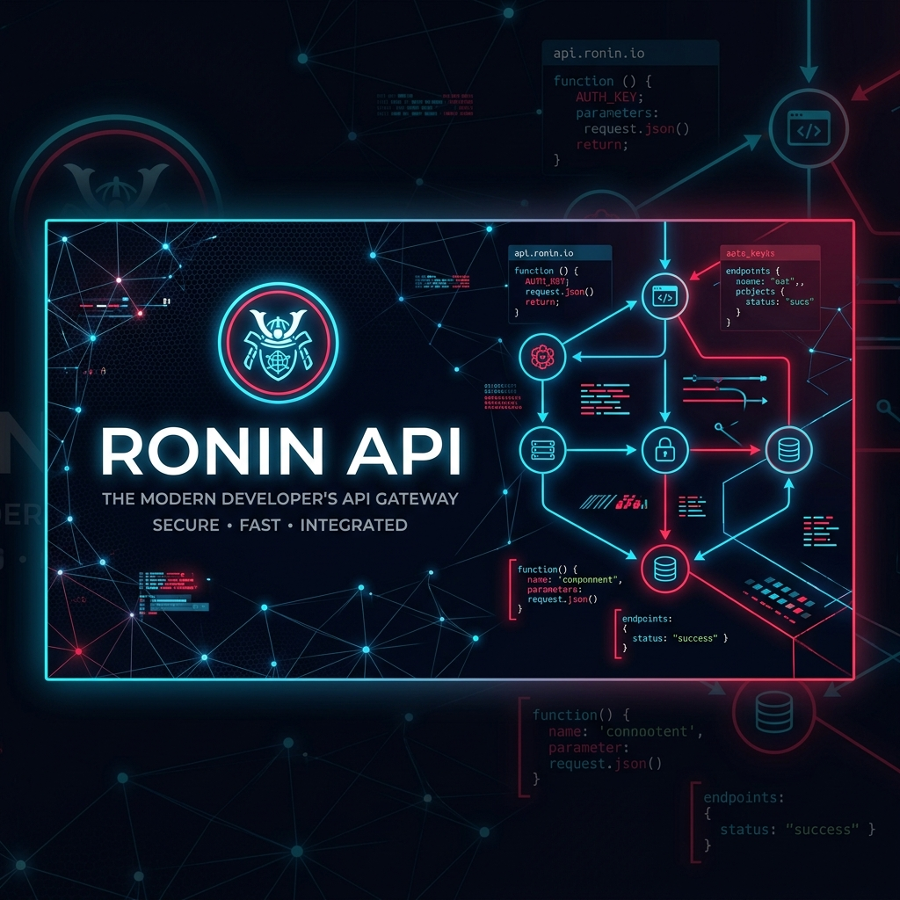
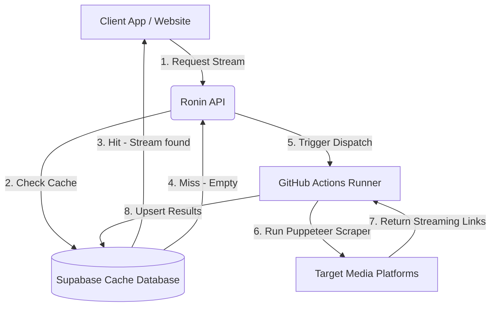

# ⚔️ Ronin API
### **A Premium, High-Performance Scraping Engine, Decryption Proxy, & Database Cache Layer**

Ronin API is a highly optimized backend coordinator designed to power both native apps (like the **RoninX Client**) and web applications (like **Animetize Play**). It acts as a serverless gateway to manage database caching, bypass cross-origin browser restrictions (CORS), decrypt complex video streaming iframes, and trigger on-demand automated scraper workflows.

---

## 🚀 Key Capabilities

*   **⚡ Sub-Second Database Caching**: Backed by **Supabase**, Ronin API queries, matches, and delivers direct stream links and manga mappings in milliseconds—saving valuable time and computing resources compared to scraping on every request.
*   **📡 On-Demand Cloud Mining**: When an episode isn't in the cache (Cache Miss), the API automatically triggers a secure **GitHub Repository Dispatch** to spin up headless Puppeteer scrapers (`ronin-on-demand.yml`) in the cloud. It harvests the media, saves it to Supabase, and updates the client.
*   **🔓 Real-Time Stream Decryption**: Built-in extractors (such as **GogoCDN / Extractors**) to decrypt complex iframe links into clean, direct video formats (like `.mp4` or `.m3u8`) for seamless player integrations.
*   **🌐 CORS & Anti-Bot Bypass**: Out-of-the-box user-agent masquerading and request proxying to bypass strict anti-scraping firewalls (like Cloudflare) and cross-origin resource sharing blocks inside web browsers.
*   **📖 Integrated Manga Reader Engine**: Secure routing endpoints mapping directly to MangaDex and ComicK to fetch details, chapters, and raw page images for custom webtoon-style readers.

---

## 🛠️ API Reference

### 📺 Anime Endpoints

#### 1. Fetch Cached Streams
Query the database cache using normalized titles and automated matching variants.
*   **URL**: `/api/db`
*   **Method**: `GET`
*   **Query Parameters**:
    *   `title` (string, required): Title of the anime series.
    *   `episode` (number, required): Episode number.
    *   `searchVariants` (JSON array string, optional): Custom title variants to check.
*   **Response**: List of cached streams (types: `http`, `torrent`, `playwright`).

#### 2. Trigger On-Demand Miner
Wakes up the cloud Puppeteer actions runner to scrape a series.
*   **URL**: `/api/trigger-miner`
*   **Method**: `GET`
*   **Query Parameters**:
    *   `title` (string, required): Title of the series.
    *   `episode` (string, optional): Episode to target first.

#### 3. Decrypt Video Iframe
Decrypts a GogoCDN/StreamSB iframe link to get raw video feeds.
*   **URL**: `/api/resolve`
*   **Method**: `GET`
*   **Query Parameters**:
    *   `url` (string, required): The target iframe source URL.

#### 4. Torrent Search
Search and scrape the latest P2P releases on Nyaa.si.
*   **URL**: `/api/downloads/:query/:episode`
*   **Method**: `GET`

---

### 📖 Manga Endpoints

#### 1. Search Manga
Search for a manga series on MangaDex or ComicK.
*   **URL**: `/manga/mangadex/:query`
*   **Method**: `GET`

#### 2. Fetch Manga Info & Chapters
*   **URL**: `/manga/mangadex/info/:mangaId`
*   **Method**: `GET`

#### 3. Load Chapter Page Images
*   **URL**: `/manga/mangadex/read/:chapterId`
*   **Method**: `GET`

---

## 📂 System Architecture



---

## 💻 Local Installation & Setup

1. **Clone the repository**:
   ```sh
   git clone https://github.com/Zcross091/Ronin-API.git
   cd Ronin-API
   ```

2. **Install Node.js dependencies**:
   ```sh
   npm install
   ```

3. **Configure Environment Variables**:
   Create a `.env` file in the root directory:
   ```env
   PORT=8000
   SUPABASE_URL=your_supabase_url
   SUPABASE_KEY=your_supabase_anon_or_service_key
   GITHUB_PAT=your_github_personal_access_token
   GOGO_DOMAINS=domain1,domain2
   ```

4. **Start the API server**:
   ```sh
   npm run start
   ```

---

## ☁️ Deployment

*   **Vercel (Serverless)**: Seamlessly integrates as a Vercel serverless function out of the box using `vercel.json` configurations.
*   **Render / Railway (Persistent)**: Can be run as a standard Node.js server using `npm run start` (listening on port `8000`).

---
<p align="center">
  <b>Developed & Maintained by Zcross091</b>
</p>
