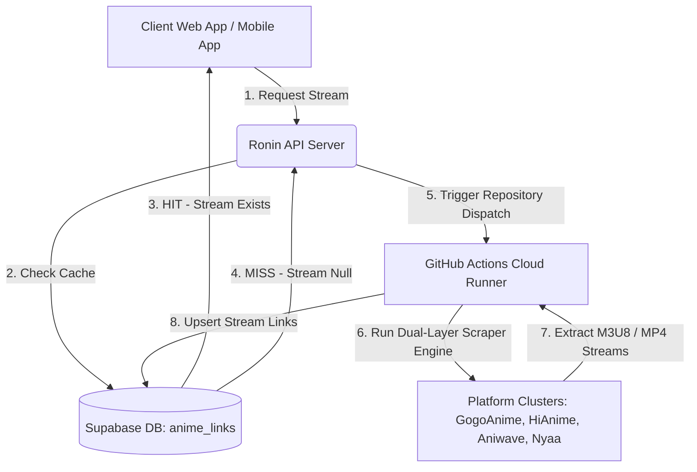

# ⚔️ Ronin API: High-Performance Anime & Manga Streaming Engine

[](https://nodejs.org/)
[](https://www.typescriptlang.org/)
[](https://supabase.com/)
[](https://github.com/features/actions)
[](LICENSE)

**Ronin API** is a state-of-the-art, high-performance **Anime Streaming Scraper, Decryption Gateway, and Database Cache Layer**. Built to power web streaming platforms (such as [Ronin Anime Web](https://zcross091.github.io/Animetize-API-Play/)) and mobile applications (like the **RoninX Client App**), it combines sub-second database caching, anti-bot Cloudflare evasion, multi-cluster failover, and GitHub-powered cloud mining.

---

## 🌟 Key Features & Capabilities

* **⚡ Sub-Second Database Caching**: Backed by **Supabase**, Ronin API serves cached `.m3u8` and `.mp4` stream links in under 50ms, drastically cutting network latency and server overhead.
* **⚡ Simultaneous Dual Sub + Dub Mining**: Mines both Japanese (SUB) and English (DUB) audio streams in parallel via concurrent `Promise.all` pipelines in a single pass.
* **🛡️ Dual-Layer Anti-Bot Evasion**: Combines high-speed Axios HTTP requests with an automated **Puppeteer Stealth Headless Browser** fallback to bypass Cloudflare, 403 blocks, and CAPTCHAs.
* **☁️ Free GitHub Actions Cloud Mining**: Harnesses GitHub's free runner infrastructure (`ronin-on-demand.yml`) to auto-crawl 200+ trending & popular series 3x daily, and mine custom user queries on demand via repository dispatch.
* **📖 Integrated Manga Engine**: Direct routing and image extraction for MangaDex and ComicK for custom webtoon readers.
* **🏴‍☠️ Decentralized P2P Torrent Mining**: Integrated scraping for high-quality Nyaa.si torrent releases with magnet link resolution.

---

## 📂 System Architecture


```mermaid
graph TD
    A[Client Web App / Mobile App] -->|1. Request Stream| B(Ronin API Server)
    B -->|2. Check Cache| C[(Supabase DB: anime_links)]
    C -->|3. HIT - Stream Exists| A
    C -->|4. MISS - Stream Null| B
    B -->|5. Trigger Repository Dispatch| D[GitHub Actions Cloud Runner]
    D -->|6. Run Dual-Layer Scraper Engine| E[Platform Clusters: GogoAnime, HiAnime, Aniwave, Nyaa]
    E -->|7. Extract M3U8 / MP4 Streams| D
    D -->|8. Upsert Stream Links| C
```

---

## 🗄️ Database Setup (Required for Both Clone & Fork)

Whether you **clone** locally or **fork** to run on GitHub Actions, you need a free [Supabase](https://supabase.com/) project to store cached stream links.

### 1. Create Supabase Table
Run the following SQL script in your Supabase **SQL Editor**:

```sql
-- Create anime_links cache table
CREATE TABLE IF NOT EXISTS public.anime_links (
    id BIGINT GENERATED BY DEFAULT AS IDENTITY PRIMARY KEY,
    title TEXT NOT NULL,
    episode INT NOT NULL,
    type TEXT NOT NULL DEFAULT 'embed',
    url TEXT NOT NULL,
    created_at TIMESTAMPTZ DEFAULT NOW(),
    CONSTRAINT unique_title_ep_type UNIQUE (title, episode, type)
);

-- Index for instant sub-second lookup speed
CREATE INDEX IF NOT EXISTS idx_anime_links_title_ep 
ON public.anime_links (title, episode);
```

---

## 💻 Method 1: How to Use by CLONING (Local / Self-Hosted Server)

Use this method if you want to run the API on your local machine, a dedicated VPS (e.g. Render, Railway, DigitalOcean), or deploy to Vercel.

### 1. Clone the Repository
```bash
git clone https://github.com/Zcross091/Ronin-API.git
cd Ronin-API
```

### 2. Install Dependencies
```bash
npm install
```

### 3. Setup Environment Variables
Create a `.env` file in the root directory:
```env
PORT=8000
SUPABASE_URL=https://your-supabase-project.supabase.co
SUPABASE_KEY=your_supabase_anon_or_service_role_key

# Optional: Domain Clusters
GOGO_DOMAINS=https://gogoanime.or.at,https://gogoanimes.cv,https://anitaku.pe
HIANIME_CLUSTER=https://hianime.to,https://hianimes.ru,https://hianime.sk
ANIWAVE_CLUSTER=https://aniwave.to,https://aniwave.com.pl
NYAASI_ACTIVE_DOMAIN=https://nyaa.si
```

### 4. Start the API Server
```bash
npm start
```
The server will start listening at `http://localhost:8000`.

### 5. Run Scraper Directly from Terminal
You can also run scrapers independently via CLI:
```bash
# Mine all episodes of an anime series into Supabase
node scrapers/anime/gogoanime.js "Solo Leveling" 1

# One-shot query with waterfall fallback
npx ts-node runQuery.ts "Naruto" 1 1 gogoanime
```

---

## 🍴 Method 2: How to Use by FORKING (Free GitHub-Powered Infrastructure)

You can run this entire backend **100% free** using GitHub's built-in compute resources (GitHub Actions & Repository Dispatch)!

### 1. Fork this Repository
Click the **Fork** button at the top right of this repository to create your own copy on GitHub.

### 2. Configure GitHub Repository Secrets
Go to your forked repository: **Settings > Secrets and variables > Actions > New repository secret**.

Add the following secrets:
| Secret Name | Value | Required |
|---|---|---|
| `SUPABASE_URL` | Your Supabase Project URL (`https://xyz.supabase.co`) | **Yes** |
| `SUPABASE_KEY` | Your Supabase `anon` or `service_role` key | **Yes** |
| `GH_PAT` | Personal Access Token (for triggering manual dispatches) | Optional |
| `GOGO_DOMAINS` | `https://gogoanime.or.at,https://gogoanimes.cv,https://gogoanime.ist` | Optional |

### 3. Enable GitHub Actions
1. Go to the **Actions** tab in your forked repository.
2. Click **"I understand my workflows, go ahead and enable them"**.

### 4. How It Works Automatically
- **3x Daily Auto-Crawl**: GitHub Actions will automatically run 3 times a day (10:00 AM, 6:30 PM, 10:40 PM IST) to deep-mine 200+ trending releases & popular series into your Supabase database.
- **On-Demand Web Dispatches**: Whenever a user on your frontend requests an unmined anime episode, your frontend sends a web dispatch to your GitHub repo, which spins up a free runner, mines the episode, saves it to Supabase, and updates your UI!

---

## 🛠️ API Reference

### 📺 Anime Endpoints

#### 1. Fetch Cached Streams (`GET /api/db`)
Returns cached stream links from Supabase.
- **Params**: `title` (string), `episode` (number)
- **Response**: Array of cached links (`http`, `embed`, `torrent`).

#### 2. Trigger On-Demand Cloud Miner (`GET /api/trigger-miner`)
Dispatches a GitHub Actions workflow runner to mine missing episodes.
- **Params**: `title` (string), `episode` (number), `source` (string)

#### 3. Decrypt Video Iframe (`GET /api/resolve`)
Decrypts GogoCDN / StreamSB player links to return direct MP4/M3U8 URLs.
- **Params**: `url` (string)

#### 4. Torrent Search (`GET /api/downloads/:query/:episode`)
Scrapes P2P torrent magnets from Nyaa.si.

---

## 📜 License & Credits

MIT LICENSE WITH ATTRIBUTION REQUIREMENT & COMMUNITY CONTRIBUTOR NOTICE
Created & Maintained by **[Zcross091](https://github.com/Zcross091)**.
